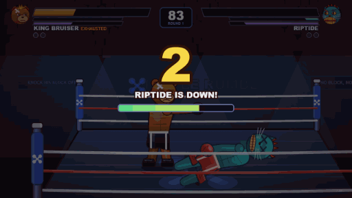
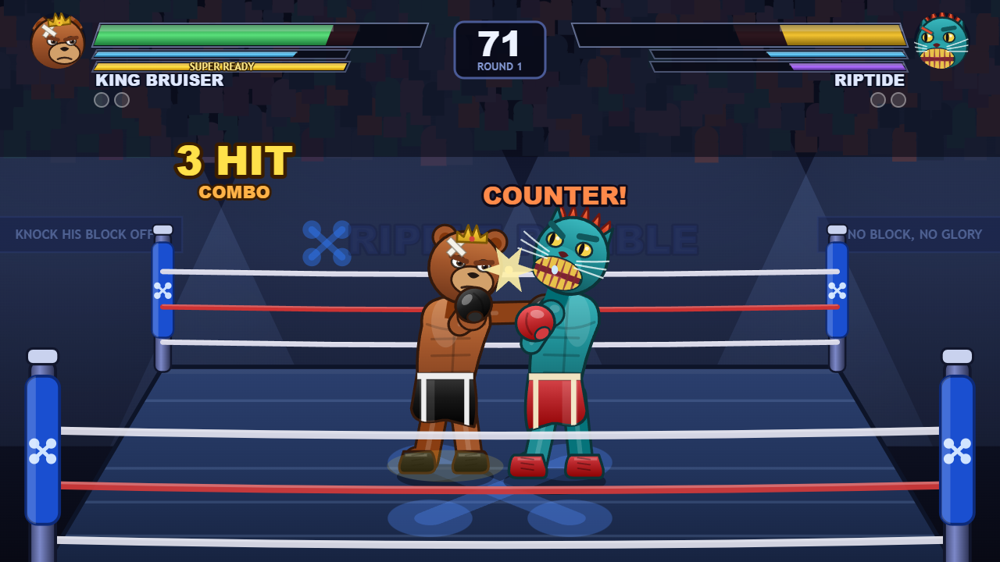

# RIPPLE RUMBLE — *Knock His Block Off!*

[](https://ripple-rumble.kubesmaniac.workers.dev)
[](https://ripple-rumble.kubesmaniac.workers.dev)
[](https://ripple-rumble.kubesmaniac.workers.dev)

[](https://ripple-rumble.kubesmaniac.workers.dev)

<sub>Five seconds of a real bout, captured from the running game. No sprites, no sprite
sheets: every frame is drawn from canvas paths as it plays.</sub>

A browser boxing game in the spirit of **Rock 'Em Sock 'Em Robots** on Game Boy Advance:
two toy fighters, one ring, and a knockout that literally sends the loser's head flying.
Five playable characters, each with their own stats, passive trait and super move.

Everything is drawn procedurally on a canvas and every sound is synthesized with WebAudio —
there are no image or audio assets to load.

## Running it

**Just want to play?** → **[ripple-rumble.kubesmaniac.workers.dev](https://ripple-rumble.kubesmaniac.workers.dev)**
Nothing to install, no account, works on a phone.

To run it locally, open `index.html` in any modern browser. That's it — no build step,
no server, no dependencies.

Click the ring once to enable sound (browsers block audio until you interact with the page).

(`serve.ps1` is optional — it starts a tiny local static server on `http://localhost:8123/`
if you'd rather run it over HTTP than from a `file://` path.)

## Controls

| | Player 1 | Player 2 |
|---|---|---|
| Move | `A` / `D` | `←` / `→` |
| Dash (invincible) | `A A` / `D D` | `←←` / `→→` |
| Guard (hold) | `S` | `↓` |
| Duck / weave (hold) | `W` | `↑` |
| Jab | `F` | `Num 1` / `J` |
| Hook | `G` | `Num 2` / `K` |
| Body blow | `H` | `Num 3` / `L` |
| Super | `T` / `Space` | `Num 0` / `U` |

`Esc` pauses · `M` music · `N` sound effects · double-click for fullscreen

[](https://ripple-rumble.kubesmaniac.workers.dev)

<sub>King Bruiser catches Riptide with a counter hook.</sub>

## The rules of the ring

- **Guard** stops head shots cold, but body blows still tear through your stamina.
- **Duck** slips under jabs and hooks — body blows punish a duck for extra damage.
- Hit an opponent during their wind-up for a **counter** (+35% damage).
- Enough punishment makes them **dizzy**: free hits, and they land 40% harder.
- Run your **stamina** to zero and you're out of gas — heavy punches stop coming out.
- Hit zero health once and you can mash your way up off the canvas at 30% health.
  Go down twice and your block comes off.
- Matches are best of three 99-second rounds. If the clock runs out, the higher health bar wins.

## The roster

| Fighter | Build | Passive | Super |
|---|---|---|---|
| **King Bruiser** — the crowned bear | Tank: slowest, hardest hitting | *Royal Hide* — guard soaks 45% more; hooks shrug off a jab mid-swing | *Crown Crusher* — overhead smash that shatters guard |
| **Silver Jack** — the ghost hare | Glass rushdown: fastest hands and feet | *Twitch Reflex* — longer dodge i-frames, meter builds 25% faster | *Hare Trigger* — eight-punch blur flurry into a rising hook |
| **El Lobo** — masked terror | All-rounder, defensive | *Counter Fang* — guarding at the last instant parries into a free counter | *Lucha Slam* — unblockable charging grab (dodge it or eat it) |
| **Riptide** — gold-fanged fury | Glass cannon: huge damage, paper defense | *Rage* — up to +40% damage as health drops | *Feral Frenzy* — 6s of super armor, faster hands, chip through guard |
| **The Ledger** — XRP prototype | Boss: durable zoner | *Auto-Settle* — repairs 2 HP/sec after 3 seconds untouched | *Liquidity Surge* — a shockwave fired across the ring |

## Modes

- **Online PVP** — fight someone on another screen. See below.
- **Arcade** — climb a four-fight ladder; The Ledger is always the final boss. Difficulty ramps each fight.
- **VS CPU** — single exhibition bout, four difficulty levels from Rookie to Champion.
- **2 Player** — both fighters on one keyboard.

## Online PVP

Both players open the **same published link**, then pick `ONLINE PVP` from the main menu:

- **Quick Match** — pairs you with anyone else waiting at that moment.
- **Create a Room** — gives you a 4-letter code; read it out and they pick **Join with a Code**.

- **Watch a Match** — take a ringside seat at a bout already running. Pick it from the list of
  live matches, which names both fighters and who is playing them.

Both players then choose a fighter (you see their pick live), and the bout starts when both lock in.
Whoever wins, `ENTER` asks for a rematch — the fight restarts once both agree.

Spectators see the fight exactly as the players do — same health bars, same hits, about 20ms behind
the authoritative screen — and the fighters' HUD shows how many people are watching. Watchers send
no input and are ignored by the fight itself; they drop back to the lobby when the match ends.

The online player uses the **Player 1 controls** (`A`/`D`, `S`, `W`, `F`, `G`, `H`, `Space`) whichever
side of the ring they are on; the HUD marks your own fighter with `YOU` and shows the round-trip time.

**How it connects.** On the published page it uses the Artifact runtime's `room` capability: the
lobby and each match are rooms, and state rides on presence updates (~30/s). One player's browser
is the authority for the fight — it runs the simulation and publishes the state, while the other
sends input and renders what it receives, so the two screens can never disagree about who got hit.
Host input is deliberately held back by half the measured round-trip so both players feel the same lag.

Everyone who plays needs access to the page, and needs to be **signed in** — the room does not admit
visitors on a public link. Opened as a local file instead of the published link, online play falls
back to a `BroadcastChannel`, which pairs two windows of the *same* browser (useful for testing).

## Putting it on the open web

The Artifact link needs a Claude sign-in. For a link anyone can click, see
[DEPLOY.md](DEPLOY.md) — `public/index.html` is a self-contained page for any
static host, and `relay/` is an optional Cloudflare Worker that makes online
play reliable on locked-down networks.

## Layout

```
index.html        page shell
css/style.css     page chrome and canvas scaling
js/audio.js       synthesized SFX, crowd ambience, two-track sequenced music
js/fighters.js    roster data + all procedural "vinyl toy" character art
js/engine.js      fighter state machine, attacks, defense, AI
js/render.js      arena, particle effects, HUD
js/net.js         online transport, matchmaking, host-authoritative sync
js/main.js        scenes, input, match flow
build.sh          bundles the source into both builds
public/index.html the open-web build (no sign-in, invite links)
relay/            optional Cloudflare Worker: the multiplayer relay
DEPLOY.md         how to put it online
```
